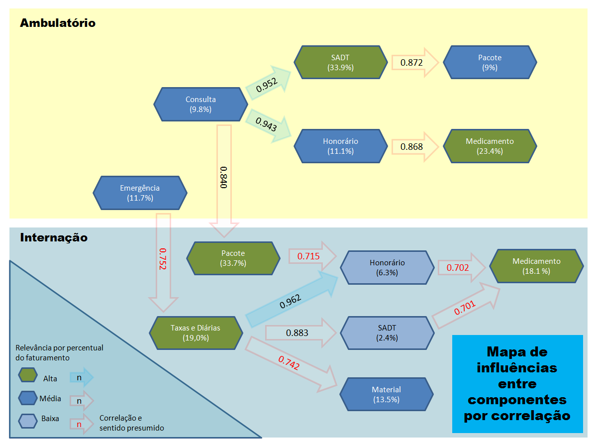
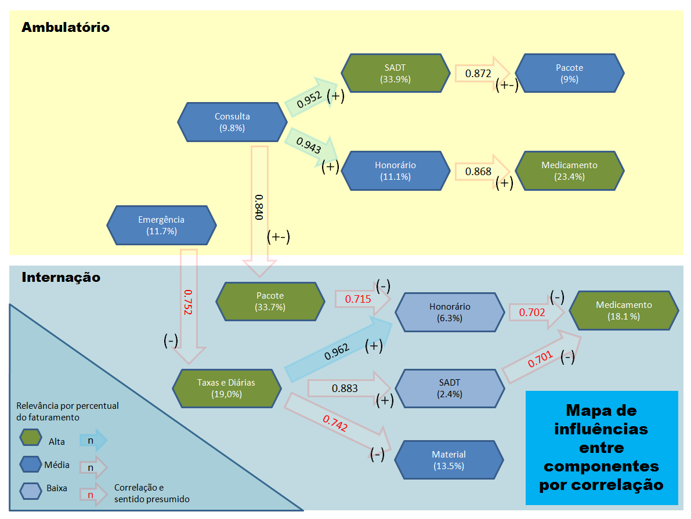

## Preparação

```{r setup, include=TRUE, message=FALSE, warning=FALSE}
knitr::opts_chunk$set(
	echo = TRUE,
	message = FALSE,
	warning = FALSE
)
library("stringr", lib.loc="~/R/win-library/3.4")
library("dplyr", lib.loc="~/R/win-library/3.4")
library("ggplot2", lib.loc="~/R/win-library/3.4")
library("readr", lib.loc="~/R/win-library/3.4")
library("tibble", lib.loc="~/R/win-library/3.4")
library("tidyr", lib.loc="~/R/win-library/3.4")
library("reshape2", lib.loc="~/R/win-library/3.4")
library("magrittr", lib.loc="~/R/win-library/3.4")
library("readxl", lib.loc="~/R/win-library/3.4")
library("modelr", lib.loc="~/R/win-library/3.4")
library("purrr", lib.loc="~/R/win-library/3.4")
library("forcats", lib.loc="~/R/win-library/3.4")

cai <- read_excel('CAIv2.xlsx') %>% # readxl: importação
  group_by(componente,internacao,amq) %>% # dplyr: agrupamento
  summarise(valor = sum(valor), qt = sum(quantidade)) %>% # dplyr: sumarização
  select(-valor) %>% # dplyr: retirada de uma coluna
  spread(componente,qt) %>% # tidyr: mudança de formato, de chave-valor para colunas
  arrange(amq, internacao) %>%  # dplyr: reordenação
  filter(amq>="20140101"); # dplyr: seleção;

cai_df <- cai %>% 
  as.data.frame() %>% 
  mutate(semestre = paste0(str_sub(amq,1,4),ifelse(str_sub(amq,5,6) > '06','02','01'))) %>% 
  as.tibble()

f.tab_cor <-  function(caidf,mtd) {
  corP <- caidf %>%  
    group_by(amq) %>% 
    summarise(consulta = sum(consulta, na.rm = TRUE), 
              domiciliar = sum(domiciliar, na.rm = TRUE), 
              emergencia = sum(emergencia, na.rm = TRUE), 
              honorario = sum(honorario, na.rm = TRUE), 
              material = sum(material, na.rm = TRUE), 
              medicamento = sum(medicamento, na.rm = TRUE), 
              nulo = sum(nulo, na.rm = TRUE), 
              pacote = sum(pacote, na.rm = TRUE), 
              remocao = sum(remocao, na.rm = TRUE), 
              sadt = sum(sadt, na.rm = TRUE), 
              taxa = sum(taxa, na.rm = TRUE)) %>% 
    as.data.frame(.) %>%
    select(-amq) %>% 
    as.tibble() %>% 
    cor(., method = mtd)
}

caiN.corP <- cai %>%
  filter(internacao == 'n') %>% 
  arrange(amq) %>%
  f.tab_cor(.,'pearson')

caiS.corP <- cai %>%
  filter(internacao == 's') %>% 
  arrange(amq) %>% 
  f.tab_cor(.,'pearson')

f.sel_cai_var <- function(var_n, ind_int) {
  cai_df %>%
    filter(internacao == ind_int) %>% 
    arrange(amq) %>% 
    select(var_n) %>% 
    as.tibble()  
}

cai_ECn_PTs.corP <- cbind(f.sel_cai_var(c('emergencia', 'consulta'), 'n'),
                          f.sel_cai_var(c('taxa', 'pacote'), 's')) %>% 
  .[1:77,] %>% 
  cor(., method = 'pearson')

f.cor_smst <- function(df,x,y) {
  tb = tibble(semestre = character(), corr = character())
  for(i in seq_along(df)) {
    tb[i,] <- cbind(names(df)[i],df[[i]][x,y])
  }

  tb %<>%  mutate(semestre = factor(semestre,levels = semestre), corr = as.double(corr)) %>% 
    return()
}

f.cor_cmpar <- function(df,dfcor,x,y) {
  print(paste(x,y))
  print('-------------------------------------------------------------')  
  print(f.cor_smst(dfcor, x, y))
  corr <- as.numeric(f.cor_smst(dfcor, x, y)$corr)
  print('-------------------------------------------------------------')
  print(paste0('Range:              ', range(corr)[1], ' > ', range(corr)[2]))
  print(paste0('Prop(Max) Perc Var: ', round((range(corr)[2]-range(corr)[1])/range(corr)[2],4)*100))
  print(paste0('Mean Corr:          ', mean(corr)))
  print(paste0('Main Corr:          ', df[x, y]))
  print(paste0('Delta Corr:         ', abs(mean(corr)-df[x, y])))
  print(paste0('Var:                ', var(corr)))
  print(paste0('DP:                 ', sd(corr)))
  print('-------------------------------------------------------------')  
  ggplot(data = f.cor_smst(dfcor, x, y),
                  aes(x = semestre, y = as.numeric(corr))) +
    geom_point(col = 'orange', size = 3) +
    geom_line(color = 'blue', size = 1, alpha = 0.5, group = 1) +
    geom_hline(yintercept = 1, col = 'green', alpha = 0.8) +
    geom_hline(yintercept = 0.75, col = 'red', alpha = 0.3) +    
    geom_hline(yintercept = 0, col = 'black', alpha = 0.3) + 
    labs(title = 'Correlações Semestrais', x = 'Semestres', y = 'Correlação') + 
    scale_y_continuous(breaks = seq(-0.5, 1.0, by = 0.1)) +
    coord_cartesian(ylim=c(-0.5, 1.0)) +
    theme_bw()  
}

smstN.corP <- cai_df %>% 
  filter(internacao == 'n') %>% 
  arrange(amq) %>%  
  split(.$semestre) %>% 
  map(f.tab_cor,'pearson')#;smstN.corP

smstS.corP <- cai_df %>% 
  filter(internacao == 's') %>% 
  arrange(amq) %>%  
  split(.$semestre) %>% 
  map(f.tab_cor,'pearson')#;smstS.corP

smst_cross.corP <- cbind(f.sel_cai_var(c('emergencia', 'consulta'), 'n'),
                    f.sel_cai_var(c('taxa', 'pacote','semestre'), 's')) %>%   
  .[1:77,] %>% 
  split(.$semestre) %>%
  map(select,-semestre) %>%
  map(cor, method = 'pearson')#;smst_cross.corP

print("Abra o código com o botão à direta e acima")

```

## Análise

Mapa Original



---

**Correlações mais relevantes em ambulatório:**
```{r resultados N, echo=FALSE, fig.height=7, fig.width=10}
f.cor_cmpar(caiN.corP,smstN.corP,'consulta','sadt')
f.cor_cmpar(caiN.corP,smstN.corP,'sadt','pacote')
f.cor_cmpar(caiN.corP,smstN.corP,'consulta','honorario')
f.cor_cmpar(caiN.corP,smstN.corP,'honorario','medicamento')
```

---

**Correlações cruzadas mais relevantes:**
```{r resultados C, echo=FALSE, fig.height=7, fig.width=10}
f.cor_cmpar(cai_ECn_PTs.corP,smst_cross.corP,'emergencia','taxa')
f.cor_cmpar(cai_ECn_PTs.corP,smst_cross.corP,'consulta','pacote')
```

---

**Correlações mais relevantes em Internação:**
```{r resultados S, echo=FALSE, fig.height=7, fig.width=10}
f.cor_cmpar(caiS.corP,smstS.corP,'pacote','honorario')
f.cor_cmpar(caiS.corP,smstS.corP,'taxa','honorario')
f.cor_cmpar(caiS.corP,smstS.corP,'taxa','sadt')
f.cor_cmpar(caiS.corP,smstS.corP,'taxa','material')
f.cor_cmpar(caiS.corP,smstS.corP,'honorario','medicamento')
f.cor_cmpar(caiS.corP,smstS.corP,'sadt','medicamento')
```

Mapa Pós Análise



---
