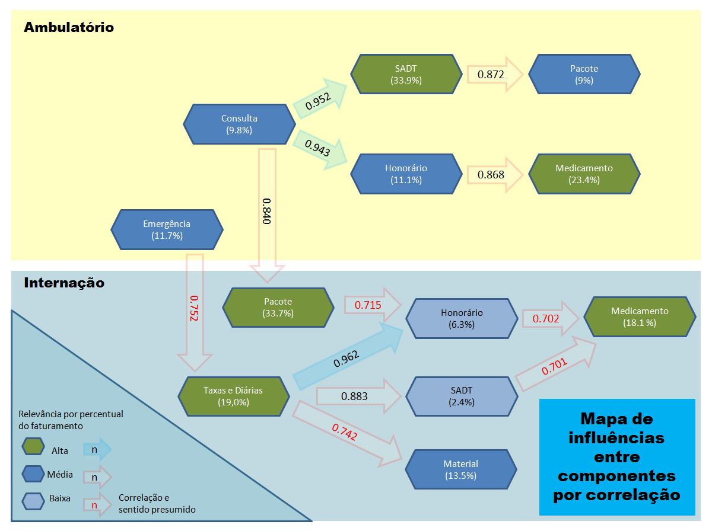

---
output:
  html_document:
    code_folding: hide
    theme: cerulean
    highlight: pygments
---
<br><br>


***

## Objetivo
  
<p align="justify">**Apresentar estudo inicial realizado para domínio da plataforma de computação estatística "R". Os dados utilizados foram extraídos a partir de BI (Banco de Inteligência de Negócio) criado pela CTI em Fevereiro de 2017, sobre contas médicas e suas dimensões, com uma série temporal entre 2014 até a última referência fechada e atualizada, em março de 2017.**</p>

***
`ATENÇÃO`
<p align="justify">*O conteúdo deste documento é de natureza confidencial e não deverá ser circulado sem expressa autorização da Coordenação Geral do Planserv.*</p>

<p align="justify">*Não será objetivo deste relatório tratar em detalhes as técnicas estatísticas utilizadas, com exceção de pontos relevantes para demonstrar a flexibilidade da ferramenta, como por exemplo a abordagem para verificar problemas de autocorrelação em séries temporais. A teoria estatística envolvida, embora interessante para alguns públicos, tonaria o relato demasiado extenso.*</p>
***

##Conteúdo

1. [Descrição da Tecnologia](#descricao-da-tecnologia)  
2. [Introdução ao Estudo Proposto](#introducao-ao-estudo-proposto)  
3. [Análise de Correlação](#analise-de-correlacao)  
4. [Gráficos para Comunicação](#graficos-para-comunicacao)  
5. [Direcionamento no Estudo](#direcionamento-no-estudo)  
6. [Análise Detalhada sobre Consulta e Exames](#analise-detalhada-sobre-consulta-e-exames)  
6.1 [Preparação](#preparacao)  
6.2 [Seleção de Escopo pelo Indicador de Internação](#selecao-de-escopo-pelo-indicador-de-internacao)  
7. [Regressão Linear](#regressao-linear)  
7.1 [Modelo Inicial](#modelo-inicial)  
7.2 [Aspectos e Avaliação da Regressão](#aspectos-e-avaliacao-da-regressao)  
7.3 [Considerações sobre Séries Temporais](#consideracoes-sobre-series-temporais)  
7.4 [Avaliação Específica para Objetos do Pacote "Orcutt"](#avaliacao-especifica-para-objetos-do-pacote-orcutt)  
7.5 [Alternativa de Transformação](#alternativa-de-transformacao)  
8. [Outros Experimentos](#outros-experimentos)  
9. [Visualizações de Dados](#visualizacoes-de-dados)  
10. [Conclusão](#conclusao)  

***
## Descrição da Tecnologia
[Retorno para Conteúdo](#conteudo)

<p align="justify">A ferramenta foi criada em 1992, por Ross Ihaka e Robert Gentleman, professores de estatística na Universidade de Auckland, Nova Zelândia, como um desenvolvimento comunitário de fonte livre (gratuito) sobre a linguagem "S", núcleo fundamental da plataforma estatística S-Plus, comercializada.</p> 

<p align="justify">"R" pode ser descrita como uma linguagem de programação interpretativa (não é necessário compilar seus scripts), possui integração com sistemas de gerenciamento de bancos de dados, outras linguagens (como Python), outras plataformas estatísticas (importações de SPSS, SAS, Stata, Minitab), MSExcel e arquivos planos.</p>

<p align="justify">Desde sua criação, seu conteúdo básico foi extensamente ampliado pela comunidade por meio da construção de pacotes que podem facilmente ser anexados ao ambiente básico, e que ampliam as funcionalidades da ferramenta contemplando a maioria das práticas estatísticas conhecidas, estilos e ferramentas para apresentações gráficas, manipulação de dados, controles de qualidade, funções para facilitar e simplificar o desenvolvimento de seu código, entre outras.</p>

<p align="justify">Como exemplo do funcionamento desta estrutura modular, abaixo estão os pacotes que foram utilizados no estudo, contendo cada um várias das funções aplicadas na geração dos resultados demonstrados abaixo:</p>

```{r setup, message = FALSE, warning = FALSE}
## Opções iniciais de configuração do ambiente --------------
knitr::opts_chunk$set(echo = TRUE)
options(scipen=999)
#### --------------------------------------------------------
library("stringr", lib.loc="~/R/win-library/3.4")
library("dplyr", lib.loc="~/R/win-library/3.4")
library("ggplot2", lib.loc="~/R/win-library/3.4")
library("readr", lib.loc="~/R/win-library/3.4")
library("tibble", lib.loc="~/R/win-library/3.4")
library("tidyr", lib.loc="~/R/win-library/3.4")
library("reshape2", lib.loc="~/R/win-library/3.4")
library("magrittr", lib.loc="~/R/win-library/3.4")
library("readxl", lib.loc="~/R/win-library/3.4")
library("modelr", lib.loc="~/R/win-library/3.4")
library("purrr", lib.loc="~/R/win-library/3.4")
library("forcats", lib.loc="~/R/win-library/3.4")
library("plotrix", lib.loc="~/R/win-library/3.4")
library("qcc", lib.loc="~/R/win-library/3.4")
## ** Pacotes básicos que compõe o Tidyverse poderiam ser ativados com uma unica linha:
#library("tidyverse", lib.loc="~/R/win-library/3.4"")
#Loading tidyverse: ggplot2
#Loading tidyverse: tibble
#Loading tidyverse: tidyr
#Loading tidyverse: readr
#Loading tidyverse: purrr
#Loading tidyverse: dplyr
```

Versão da plataforma "R": 3.4.1 (2017-06-30) "Single Candle"<br>
<https://www.r-project.org/><br>
Versão do ambiente de programação "RStudio": 1.0.143<br>
<https://www.rstudio.com/><br>
Pacotes principais nesta apresentação: Tidyverse 1.1.1<br>
<http://tidyverse.org/><br>

<p align="justify">A apresentação deste relatório foi integralmente concebida com a utilização do ambiente de programação RStudio, com a funcionalidade R-Markdown. <http://rmarkdown.rstudio.com/index.html></p>


<br><br>
<p align="right">*Ambiente de desenvolvimento integrado, RStutdio*</p>
***

<p align="justify">Para efeito demonstrativo, a maior parte dos comandos e funções utilizados para geração de resultados na ferramenta foi mantido à vista, porém a supressão destes itens, mantendo apenas tabelas, comentários e gráficos é facilmente executada dentro da estrutura RStudio + R-Markdown.</p>
***
## Introdução ao Estudo Proposto
[Retorno para Conteúdo](#conteudo)

<p align="justify">O trabalho teve início com dados gerados a partir da ferramenta Power BI e exportados para Excel, tratados e importados para o "R" de maneira não transformada (arquivo plano), e posteriormente também importados com transformações para processamento estatístico (onde colunas = variáveis). Os dados incluídos seguem as seguintes características:</p>

- Série temporal pela data de atendimento do componente assistencial;
- Duas consolidações de quantidade por mês de referência, uma entre dias 1 a 15 e outra entre 16 a 31, para aumento da eficácia dos testes relacionados;
- Na transformação, foram filtrados dados de maior relevância, a partir de janeiro de 2014, gerando 78 observações por componente;
- Dados de Componente, Ano/mês/Quinzena e Indicador de Internação (CAI);

```{r dados originais}
#### Formato original, trabalhado no MS Excel ---------------
cat("Formato original, trabalhado no MS Excel")
org <- read_excel('CAIv2.xlsx');org;
#### Formato para processamento estatístico -----------------
cat("Formato para processamento estatístico")
cai <- read_excel('CAIv2.xlsx') %>% # readxl: importação
  group_by(componente,internacao,amq) %>% # dplyr: agrupamento
  summarise(valor = sum(valor), qt = sum(quantidade)) %>% # dplyr: sumarização
  select(-valor) %>% # dplyr: retirada de uma coluna
  spread(componente,qt) %>% # tidyr: mudança de formato, de chave-valor para colunas
  arrange(amq, internacao) %>%  # dplyr: reordenação
  filter(amq>="20140101"); cai; # dplyr: seleção;
```
***
## Análise de Correlação
[Retorno para Conteúdo](#conteudo)

<p align="justify">A partir da tabela transformada acima, foi criada uma matriz de correlação entre os componentes, para verificação de quais pares apresentavam influência sobre os demais. De modo a avaliar todas os relacionamentos, foram criadas três versões: completo (C), sem internação(N) e com internação (S):</p>

```{r correlação, warning=FALSE}
#### Transformações sobre dados da "CAI" com uma função -----
f.tab_cor <-  function(caidf,mtd) {
  corP <- caidf %>%  
    group_by(amq) %>% 
    summarise(consulta = sum(consulta, na.rm = TRUE), 
              domiciliar = sum(domiciliar, na.rm = TRUE), 
              emergencia = sum(emergencia, na.rm = TRUE), 
              honorario = sum(honorario, na.rm = TRUE), 
              material = sum(material, na.rm = TRUE), 
              medicamento = sum(medicamento, na.rm = TRUE), 
              nulo = sum(nulo, na.rm = TRUE), 
              pacote = sum(pacote, na.rm = TRUE), 
              remocao = sum(remocao, na.rm = TRUE), 
              sadt = sum(sadt, na.rm = TRUE), 
              taxa = sum(taxa, na.rm = TRUE)) %>% 
    as.data.frame(.) %>%
    select(-amq) %>% 
    as.tibble() %>% 
    cor(., method = mtd)
}

#### Filtragem e calculo com função criada acima ------------
caiC.corP <- cai %>%
  arrange(amq, internacao) %>% 
  f.tab_cor(.,'pearson');as.tibble(caiC.corP)

#### Apenas a primeira tabela (^) será demonstrada ----------
caiN.corP <- cai %>%
  filter(internacao == 'n') %>% 
  arrange(amq) %>%
  f.tab_cor(.,'pearson')

caiS.corP <- cai %>%
  filter(internacao == 's') %>% 
  arrange(amq) %>% 
  f.tab_cor(.,'pearson')

#### Limpeza de objetos, caso necessário para recriação -----
rm(caiC.cor,caiS.cor,caiN.cor)

#### Representação por simbolos -----------------------------
Ccorgrid <- symnum(caiC.corP);Ccorgrid

#### Apenas a primeira tabela (^) será demonstrada ----------
Ncorgrid <- symnum(caiN.corP);#Ncorgrid
Scorgrid <- symnum(caiS.corP);#Scorgrid

#### Tratamento para apresentação gráfica -------------------
caiC.corP[lower.tri(caiC.corP)] <- NA
caiN.corP[lower.tri(caiN.corP)] <- NA
caiS.corP[lower.tri(caiS.corP)] <- NA
```
***
## Gráficos para Comunicação
[Retorno para Conteúdo](#conteudo)

<p align="justify">Embora suficientes para avaliação estatística de profissionais, os instrumentos apresentados até então não são adequados para demonstração de resultados  e apreciação de públicos em geral (outras capacidades sobre visualização serão tratadas ao final deste estudo, no tópico anterior à conclusão).</p>
<p align="justify">Com objetivo de evoluir da análise para comunicação, os dados de correlação foram submetidos a manipulação por um dos pacotes especialistas do "R" para apresentações gráficas (GGPlot2), foram então gerados os mapas de correlação com estética mais adequada:</p>

```{r plot correlação 01, fig.height=7, fig.width=10}
#### Gráfico gerado a partir do comando abaixo (exemplo) ----
GGcorC <- ggplot(data = melt(caiC.corP, na.rm = TRUE), aes(Var2, Var1, fill = value)) +
  geom_tile(color = "white") +
  theme_minimal()+ 
  theme(axis.text.x = element_text(angle = 45, 
                                   vjust = 1, 
                                   size = 12, 
                                   hjust = 1),
        axis.title.x = element_blank(),
        axis.title.y = element_blank())+
  guides(fill = guide_colorbar(barwidth = 1, 
                               barheight = 7,
                               title.position = "bottom")) +
  coord_fixed();GGcorC

#### Camada adicionada ao gráfico original ------------------
GGcorC + 
  geom_text(aes(Var2, Var1, label = format(value, digits = 1, nsmall= 3)), 
            color = "black", 
            size = 3) +
  scale_fill_distiller(palette = "Spectral", 
                       #trans = "reverse",
                       #space = "Lab", 
                       name="Correlação de\nPearson\n|Total|")

```

Demais gráficos (Correlação de componentes com Internação = N,S), comandos do "R" para geração foram ocultados:

```{r plot correlação 02, fig.height=7, fig.width=10}
f.cor_plot <- function(ds, plt, dirc, lab_leg, dig) {
  GGcor <- ggplot(data = melt(ds, na.rm = TRUE), aes(Var2, Var1, fill = value)) +
    geom_tile(color = "white") +
    scale_fill_distiller(palette = plt, 
                        direction = dirc,
                        name=lab_leg) +  
    theme_minimal()+ 
    theme(axis.text.x = element_text(angle = 45, 
                                    vjust = 1, 
                                    size = 12, 
                                    hjust = 1),
          axis.title.x = element_blank(),
          axis.title.y = element_blank())+
    guides(fill = guide_colorbar(barwidth = 1, 
                                barheight = 7,
                                title.position = "bottom")) +
    coord_fixed()
  GGcor + 
    geom_text(aes(Var2, Var1, label = format(value, digits = dig, nsmall= 3)), 
              color = "black", 
              size = 3)
}

f.cor_plot(caiN.corP,"RdYlGn", 1,"Correlação de\nPearson\n|Ambulatório|",1)

f.cor_plot(caiS.corP,"Set2", -1,"Correlação de\nPearson\n|Internação|",2)
```

***
## Direcionamento no Estudo
[Retorno para Conteúdo](#conteudo)

<p align="justify">Após verificadas as influências, se fez necessária uma seleção para detalhamento investigativo, além de um entendimento sobre o sentido da correlação. Deste modo foi realizada uma consulta pelo BI de Contas para verificação de quais componentes correlacionados se mostravam relevantes, por valor e percentual no faturamento acumulado entre 2014 e 2017:</p>

```{r avaliação de relevância}
#### Tabela criada manualmente para simplificação de nomes --
(depara_componente <- read_excel('depara_componente.xlsx'))

#### Renomeação/substituição/exclusão de colunas (estudo) ---
depara_componente <- depara_componente %>% 
  select(componente = "Componente assistencial", comp = "componente")

#### Importações (Geradas pelo Power BI com um click) -------
`dataset` = read.csv('~/REditorWrapper_e74c054e-473b-47b7-b164-7b93f69f36af/input_df_0ab2289d-603e-43e7-9cef-461c578edbbb.csv', check.names = FALSE, encoding = "UTF-8", blank.lines.skip = FALSE);
`dataset2` = read.csv('~/REditorWrapper_6b9a785a-59bf-48ad-abdd-04471637f315/input_df_26cec917-4b9e-45bf-9a31-7a50e9d1f2d7.csv', check.names = FALSE, encoding = "UTF-8", blank.lines.skip = FALSE);

#### Criação de resumos, por indicador de internação --------

f.resumo_valor <- function(ds) {
  dsR <- ds %>% 
  select(internacao = "Indicador de Internação", 
         componente = "Componente assistencial",
         valor = "Valor Total",
         percentual =  "Valor Total.1",
         quantidade = "Quantidade Aprovada") %>% 
  mutate(percentual = as.numeric(format(percentual*100, digits = 2))) %>% 
  merge(., depara_componente, by = "componente") %>% 
  mutate(componente = comp) %>% 
  select(-comp)
}

resumo_valor_N <- f.resumo_valor(dataset)

resumo_valor_S <- f.resumo_valor(dataset2)

#### Unificação de Tabelas-----------------------------------
resumo_valor <- rbind(resumo_valor_N,resumo_valor_S) %>% 
  arrange(internacao, desc(percentual)) %>% 
  select(-valor); resumo_valor
```

<p align="justify">Foram então filtradas as maiores Correlações, e agregado o valor como uma nova coluna, para correlações com internação, e sem internação. Atenção especial foi dada ao relacionamento de pacotes para internação = "S":</p>

```{r maiores correlações}
#### Transformação de tabela de correlação e filtro ---------
topcorS <- melt(caiS.corP, na.rm = TRUE) %>% 
  filter((value >= 0.85 | ((Var1 == "pacote" | Var2 == "pacote" |
                            Var1 == "medicamento" | Var2 == "medicamento" |
                            Var1 == "material" | Var2 == "material") 
                           & value >= 0.70)) & value != 1) %>% 
  arrange(desc(value))

topcorN <- melt(caiN.corP, na.rm = TRUE) %>% 
  filter(value >= 0.85 & value != 1) %>% 
  arrange(desc(value))

#### Lookup de Tabelas e reordenação de colunas -------------
topcorS_W <- topcorS %>% 
  add_column(Var1_prct = resumo_valor_S[match(topcorS$Var1, resumo_valor_S$componente),4]) %>% 
  add_column(Var2_prct = resumo_valor_S[match(topcorS$Var2, resumo_valor_S$componente),4]) %>% 
  select("Var1","Var1_prct","Var2","Var2_prct",Corr = "value");topcorS_W
cat('^^ Internação ^^')

topcorN_W <- topcorN %>% 
  add_column(Var1_prct = resumo_valor_N[match(topcorN$Var1, resumo_valor_N$componente),4]) %>% 
  add_column(Var2_prct = resumo_valor_N[match(topcorN$Var2, resumo_valor_N$componente),4]) %>% 
  select("Var1","Var1_prct","Var2","Var2_prct",Corr = "value");topcorN_W
cat('^^ Ambulatório ^^')
```

<p align="justify">Devido à relevância de Taxas e Pacotes em internação, foram averiguadas as correlações cruzadas (presumidamente altas) a partir de consultas e emergência, que são considerados como ambulatoriais.</p>

<p align="justify">Para fins de estudo, foram criadas tabelas separadas e individualizadas para a análise, porém uma abordagem similar às tabelas de correlação geral poderia ter sido utilizada, com menos processos intermediários na ferramenta, e diminuição de passos:</p>

```{r correlacao cruzada}
#### Preparação: Transformação de tabela agrupada em plana --
cai_df <- cai %>% 
  as.data.frame() %>% 
  mutate(semestre = paste0(str_sub(amq,1,4),ifelse(str_sub(amq,5,6) > '06','02','01'))) %>% 
  as.tibble()

#### Função customizada para redução de passos --------------
f.sel_cai_var <- function(var_n, ind_int) {
  cai_df %>%
    filter(internacao == ind_int) %>% 
    arrange(amq) %>% 
    select(var_n) %>% 
    as.tibble()  
}

#### Cor. Emergencia, Consulta > Taxas, Pacotes em Internação
cai_ECn_PTs.corP <- cbind(f.sel_cai_var(c('emergencia', 'consulta'), 'n'),
                          f.sel_cai_var(c('taxa', 'pacote'), 's')) %>% 
  .[1:77,] %>% 
  cor(., method = 'pearson');cai_ECn_PTs.corP
```
<br>
<p align="right">*\* Mapeamento sujeito à mudanças*</p>

***
## Análise Detalhada sobre Consulta e Exames
[Retorno para Conteúdo](#conteudo)

### Preparação
[Retorno para Conteúdo](#conteudo)

<p align="justify">Com base nas descobertas apontadas pela correlação, e considerando o sentido de influência conhecido de consultas sobre exames, foi então realizada uma investigação de cunho estatístico inferencial, com técnicas mais relevantes para determinação de um modelo preditivo, onde a variável independente é a quantidade de consultas, e a resposta é a quantidade de exames. Tais analises deverão ser realizadas sobre outros conteúdos e elementos, com diversos e adequados modelos de regressão, e com maior detalhamento para efetividade e precisão, como por exemplo, a quebra de consultas e exames de uma determinada especialidade médica.</p>

```{r preparação para SC}
#### Preparação: Consulta sobre exames em Internação --------

cai_SCs <- cbind(f.sel_cai_var('sadt','s'), f.sel_cai_var('consulta','n'))

#### Preparação: Consulta sobre exames sem Internação -------

cai_SCn <- cbind(f.sel_cai_var('sadt','n'), f.sel_cai_var('consulta','n'))

#### Preparação: Consulta sobre exames totais ---------------

cai_SCc <- cai_df %>% 
  select(amq,sadt) %>% 
  group_by(amq) %>% 
  summarise(sadt=sum(sadt)) %>% 
  as.data.frame() %>% 
  select(sadt) %>% 
  as.tibble() %>% 
  add_column(consulta = f.sel_cai_var('consulta','n')$consulta)

## Inclusão de coluna "z", análise de variação por desvios padrão, outliers acima de 3 
zSc <- scale(cai_SCc$sadt, center = TRUE, scale = TRUE)
cai_SCc <- cai_SCc %>% add_column(z = zSc[1:dim(cai_SCc)[1]])
```

### Seleção de Escopo pelo Indicador de Internação
[Retorno para Conteúdo](#conteudo)

<p align="justify">Também foi criada uma tabela para avaliação de relevância de SADT total, com e sem internação:</p>

```{r sadt total, N, S, fig.height=7, fig.width=10}
cai_g <- cai_SCc %>% 
  select(consulta, sadt_t = sadt) %>% 
  add_column(sadt_n = cai_SCn$sadt) %>% 
  add_column(sadt_s = cai_SCs$sadt)

plot(cai_g)
```

<p align="justify">A matriz de gráficos de dispersão indicou uma forte semelhança de comportamento entre **Consulta Eletiva sobre SADT total**, e **Consulta Eletiva sobre SADT sem internação (ambulatorial)**. Também pode ser verificado que **Consulta Eletiva sobre SADT com internação (hospitalar)** apresenta uma relação mais difusa, pois exames restritos ao ambiente hospitalar geralmente são disparados por outros componentes, fato que poderia ser comprovado com uma analise de correlação específica, caso a resposta gráfica não fosse suficiente. Com base nos resultados, o estudo foi então direcionado para modelo entre **Consulta e SADT total**.</p>
***
## Regressão Linear
[Retorno para Conteúdo](#conteudo)

### Modelo Inicial
[Retorno para Conteúdo](#conteudo)

<p align="justify">Após determinação das variáveis de estudo, a criação do modelo é bastante simplificada pela ferramenta, através da função lm (Linear Model), onde "sadt ~ consulta" representa uma equação de previsão de quantidades de sadt por meio da informação de quantidades de consulta:</p>

```{r regressão, fig.height=7, fig.width=10}
#### Gerar objeto com modelo --------------------------------
f.lm_checkin <- function(ds, modl) {
  lm.x <- lm(modl, data = ds)
  print(summary(lm.x))
  print(confint(lm.x, level=0.99))
  for (i in c(1:3,5)) {
    plot(lm.x, which = i)
  }
  return(lm.x)
}
## Gráficos
## (1) (2)
## (3) (4)
par(mfrow = c(2,2), oma = c(0, 0, 1.1, 0))
lm.cai_SCc <- f.lm_checkin(cai_SCc, 'sadt ~ consulta')
#### Retornando à configurção de plotagem com Gráfico Único -
par(mfrow = c(1,1), oma = c(0, 0, 0, 0))
```
Formula:

<p align="left"><font size="3" color="brown">$y = \beta_0 + \beta_1x$</font>, onde $\beta_0$ = intercepto e $\beta_1$ = inclinação</p>
<p align="left"><font size="3" color="brown">$_{qt}sadt = \beta_0 + (\beta_1 * _{qt}consulta)$</font></p>
<p align="left"><font size="3" color="brown">$_{qt}sadt =   72791.6402 +  (11.6330 * _{qt}consulta)$</font></p>

<p align="justify">Apresentando valores de $p$ inferiores a **0,01** para ambos os coeficientes da equação e também para a estatística de variação $F$, a regressão simples pode ser considerada de boa qualidade e suficiente, comprovando as tendências previamente apontadas na correlação. Caso necessário, modelos de outras naturezas poderiam ser aplicados na ferramenta (lineares múltiplos, quadráticos e não lineares, como polinomiais e exponenciais).</p>

<p align="justify">O valor do coeficiente de determinação $r^2$ de **0.8948** significa que a quantidade de consultas explica **89,48%** da variação de quantidade de exames, e portanto o valor do modelo como instrumento preditivo aparenta ser relevante, inicialmente.</p>

<p align="justify">A função padrão de plotagem de gráfico aplicada ao objeto do modelo na ferramenta, é excelente para verificação rápida de Linearidade (gráfico 1, superior esquerdo), normalidade (gráfico 2, superior direito) e Igualdade (gráfico 3, inferior esquerdo), além de oferecer também um teste de alavancagem (gráfico 4, inferior direito), que verifica se alguma observação extrema tem influência forte sobre todo o modelo.</p>

O modelo pode ser visualizado no gráfico abaixo:

```{r, modelos inicial, fig.height=7, fig.width=10}
#### Incluir conluna com valores previstos ------------------
cai_SCc <- cai_SCc %>% add_predictions(lm.cai_SCc) #modelr
#### Gráfico do modelo --------------------------------------
ggplot(cai_SCc, aes(y = consulta)) +
  geom_point(aes(x = sadt), color = "blue", alpha = 0.5, size = 3) +
  geom_line(aes(x = pred),color = "red", size = 1.2) +
  labs(title = 'Modelo proposto', 
       x = 'SADT', y = 'Consulta')
```

### Aspectos e Avaliação da Regressão
[Retorno para Conteúdo](#conteudo)

<p align="justify">Embora as evidências apontem para um modelo bem construído, existe ainda a necessidade de verificar todas as quatro premissas da regressão: Linearidade (que pode ser verificada acima); Independência de variáveis (de suma importância no uso de séries temporais, devido à possibilidade de Autocorrelação: a ocorrência de dependência entre observações adjacentes no tempo), normalidade e Igualdade de variâncias para valores previstos (de SADT) ao longo de todos os valores de previsão (consulta).</p>

### Considerações sobre Séries Temporais
[Retorno para Conteúdo](#conteudo)

<p align="justify">No aspecto de independência das variáveis, se faz necessária a utilização de técnicas como os testes de **Durbin-Watson** ou **Breusch-Godfrey**, para verificar autocorrelação. Uma vez identificada a técnica estatística desejada, uma consulta em sites de busca geralmente é suficiente para apontar a função e pacote correspondentes, estes podem ser adicionados de maneira simples por meio do ambiente RStudio, tornam-se disponíveis para uso nos scripts.</p>

```{r teste de autocorrelação, message=FALSE, warning=FALSE}
#### Definição do repositório para download -----------------

## options(repos = 'http://vps.fmvz.usp.br/CRAN/')

#### Instalação do novo pacote ------------------------------

## install.packages("lmtest")

#### Ativação do pacote com o teste estatístico -------------
library("lmtest", lib.loc="~/R/win-library/3.4")
#### Testes de autocorrelação -------------------------------
dwtest(lm.cai_SCc)
bgtest(lm.cai_SCc, order = 2)
```

<p align="justify">Ambos os testes apontam valor $p$ tendendo a zero, o que indica a rejeição da hipótese nula (que assume a Autocorrelação = 0), e portanto uma transformação é necessária, para enquadramento do princípio de independência de variáveis. Novamente, uma vez identificada a técnica estatística (neste caso, transformação de **Cochrane Orcutt**), uma pesquisa é feita, a função e pacote são identificados, importados na ferramenta, e utilizados após ativação. Em seguida encontra-se o gráfico com ambos os modelos, original com autocorrelação (em vermelho) e transformado, sem ruídos ($rho$) de autocorrelação (em verde):</p>

```{r transformação e gráficos, fig.height=7, fig.width=10}
#### Ativação do pacote com transformação para Autocorrelação
library("orcutt", lib.loc="~/R/win-library/3.4")
#### Transformação dos modelo para eliminação do ruído ------
lmT.SCc <- cochrane.orcutt(lm.cai_SCc)
#### Inclusão de coluna com valores previstos ajustados -----
cai_SCc <- cai_SCc %>% add_column(predT = as.vector(fitted(lmT.SCc))) #modelr
#### Novo gráfico, com ambos modelos ------------------------
ggplot(cai_SCc, aes(y = consulta)) +
  geom_point(aes(x = sadt), color = "blue", alpha = 0.5, size = 3) +
  geom_line(aes(x = pred),color = "red", size = 1.2) +
  geom_line(aes(x = predT), color = "green", size = 1.2) +
  labs(title = 'Modelo original e transformado, procedimento Cochrane Orcutt, *em verde', 
       x = 'SADT', y = 'Consulta')
```

<p align="justify">Além da análise gráfica, uma revisão do sumário do novo modelo pode ser realizado com uma função específica do novo pacote:</p>

```{r análise após transformação}
summary.orcutt(lmT.SCc)
```

Formula:

<p align="left"><font size="3" color="brown">$y = \beta_0 + \beta_1x$</font>, onde $\beta_0$ = intercepto e $\beta_1$ = inclinação</p>
<p align="left"><font size="3" color="brown">$_{qt}sadt = \beta_0 + (\beta_1 * _{qt}consulta)$</font></p>
<p align="left"><font size="3" color="brown">$_{qt}sadt =  131162.26639 + (10.31995 * _{qt}consulta)$</font></p>

<p align="justify">Primeiramente, é importante avaliar o resultado do teste de **Durbin Watson** para o modelo transformado, com valor próximo à **2**, e $p$ = **0.6253**, o que significa que não há evidências suficientes para rejeitar $h_0$ (*hipótese nula*), onde a autocorrelação é igual a *zero*. O modelo ajustado revela as mesmas boas características, com valor $p$ para o teste $t$ dos coeficientes aproximadamente zero, assim como $p$ para a estatística de variação ($F$). O valor de $r^2$ dos novos resultados mostram que a variável quantidade de consultas explica **94,55%** da variação de SADT, demonstrando a validade do novo modelo para predição.</p>

### Avaliação Específica para Objetos do Pacote "Orcutt"
[Retorno para Conteúdo](#conteudo)

<p align="justify">Devido à particularidade do pacote utilizado para a transformação (com objetos de modelo linear proprietários), uma análise dos aspectos da regressão por funções padrão da ferramenta é limitada. Se faz necessária programação específica para diagnóstico de linearidade, normalidade e igualdade de variâncias:</p>

Padronização de resíduos:<font size="4" color="brown">$_{Std.}e = (\frac{e_i}{\sigma_e})_{1\leqslant i\leqslant n}$</font>,
onde <font size="3" color="brown">$\sigma = \sqrt\frac{\sum_{i=1}^n(X_i-\bar X)^2}{n-1}$</font>

```{r diagnósticos construídos, fig.height=7, fig.width=10}
#### Valores previstos --------------------------------------
fit_r <- fitted(lmT.SCc)
#### Gráfico padrão (1) Linearidade -------------------------
plot(fit_r, resid(lmT.SCc),
     ylab = "Resíduos/Erros", 
     xlab = "Valores Previstos",
     main = "Linearidade e Variância")
#### Linha de referência ------------------------------------
smt = smooth.spline(fit_r, resid(lmT.SCc), spar=1)
abline(h = 0, lty = 2)
lines(smt, col='red', lwd=1)

#### Resíduos padronizados ----------------------------------
std_r <- resid(lmT.SCc)/sd(resid(lmT.SCc))
# ou std_r <- scale(resid(lmT.SCc), center = FALSE, scale = TRUE)

#### Gráfico padrão (2) Normalidade -------------------------
qqnorm(std_r)
#### Linha de referência ------------------------------------
qqline(std_r, lty = 2)

#### Raiz de resíduos padronizados --------------------------
std_r <- sqrt(abs(std_r))
#### Gráfico padrão (3) Igualdade ---------------------------
plot(fit_r, std_r, 
     ylab = expression(sqrt("Resíduos Padrão")), 
     xlab = "Valores Previstos",
     main = "Escala e Localização de Resíduos")
#### Linha de referência ------------------------------------
smt = smooth.spline(fit_r, std_r, spar=1)
lines(smt, col='red', lwd=1)
```

### Alternativa de Transformação
[Retorno para Conteúdo](#conteudo)

<p align="justify">Uma alternativa de eliminação dos ruídos da autocorrelação é o procedimento de **Hildreth-Lu**, porém esta abordagem exige aplicação da transformação para todas as novas predições, pois existe uma alteração da escala dos dados:</p>

```{r segunda transformação, fig.height=7, fig.width=10}
#### Ativação do pacote com a segunda forma de transformação
library("HoRM", lib.loc="~/R/win-library/3.4")
#### Valor de rho a partir da primeira transformação --------
lmT.SCc["rho"]
#### Regressão com o novo procedimento ----------------------
lmT_hil.SCc <- hildreth.lu(x = cai_SCc$consulta, y = cai_SCc$sadt, rho = 0.7097007)
         ## rho representa o ruído gerado pela autocorrelação

#### Extração de dados a partir do objeto do modelo ---------
cai_SCc_Hil <- as.tibble(lmT_hil.SCc[["model"]]) %>%
  select(sadt = y, consulta = x)
#### Inclusão de valores previstos __------------------------    
cai_SCc_Hil <- add_predictions(cai_SCc_Hil,lmT_hil.SCc)
#### Novo gráfico -------------------------------------------
ggplot(cai_SCc_Hil, aes(y = consulta)) +
  geom_point(aes(x = sadt), color = "dark blue", alpha = 0.5, size = 3) +
  geom_line(aes(x = pred),color = "orange", size = 1.2) +
  labs(title = 'Dados e Modelo transformados pelo procedimento de Hildreth-Lu', 
       x = 'SADT Transformado', y = 'Consulta Transformada')
```

<p align="justify">A vantagem do pacote *"HoRM"* sobre o pacote *"Orcutt"* é a geração de objeto de modelo linear padrão, o que facilita os diagnósticos básicos do "R".</p>

```{r analise após segunda transformação, fig.height=7, fig.width=10}
#### Leitura do objeto do modelo ----------------------------
f.lm_extract <- function(lmo) {
  print(summary(lmo))
  print(confint(lmo, level=0.99))
  for (i in c(1:3,5)) {
    plot(lmo, which = i)
  }
  return(lmo)
}
## Gráficos
## (1) (2)
## (3) (4)
par(mfrow = c(2,2), oma = c(0, 0, 1.1, 0))
invisible(f.lm_extract(lmT_hil.SCc))
#### Retornando à configurção de plotagem com Gráfico Único -
par(mfrow = c(1,1), oma = c(0, 0, 0, 0))
```

<p align="justify">O sumário do terceiro modelo também confirma a rejeição das hipóteses nulas (coeficientes iguais a zero), pelos testes $t$ e $F$, e apresentando o mesma explicação de **94,55%** da variação de SADT por consulta, pois o mesmo valor de ruído foi aplicado à segunda transformação a partir do cálculo realizado no procedimento da primeira transformação (Orcutt).</p>

***
## Outros Experimentos
[Retorno para Conteúdo](#conteudo)

<p align="justify">Outras técnicas e visualizações foram aplicadas dentro do estudo, e estão representadas a seguir, com respectivos comentários:</p>

```{r demais aspectos, fig.height=7, fig.width=10}
#### Intervalos para os valores previstos, IC 95% -----------
as.tibble(predict.lm(lmT_hil.SCc, level=0.95, interval = 'confidence'))

#### Preparação/Gráfico de intervalos do modelo original ----

#rm(SCc.CI)

SCc.CI <- as.tibble(predict.lm(lm.cai_SCc, level=0.95, interval = 'confidence')) %>% 
  add_column(., rn = as.numeric(row.names(.)))
cai_SCc <- add_column(cai_SCc, rn = as.numeric(row.names(SCc.CI)))

#### Intervalos pelo pacote plotrix -------------------------
plotCI(SCc.CI$fit[1:6], ui = SCc.CI$upr[1:6], li = SCc.CI$lwr[1:6], ylab = NULL, xlab = NULL)

#### Intervalos com apresentação melhorada pelo GGplot2 -----
ggplot(SCc.CI[25:65,], aes(x = rn, y = fit, col = fit)) +
  geom_point(size = 2) +
  geom_errorbar(aes(ymax = upr, ymin = lwr)) +
  geom_line(color = "light blue", size = 0.4, alpha = 0.5) +
  geom_point(data = cai_SCc[25:65,], aes(y = sadt),col = "red" , size = 1.5) +
  theme_dark() +
  scale_colour_gradient2(name="Variação em\ntorno da média", 
                        low = "white", 
                        mid = "orange",
                        midpoint = 591713,
                        high = "white") +
  labs(title = 'Amostra de assertividade nas previsões', 
       x = 'Observações', y = 'Valor Previsto')

#### Teste de distribuição T para média de SADT, IC 95% ----- 
t.test(cai_SCc$sadt, conf.level = 0.95)

#### Teste de distribuição T para média do modelo, IC 95% --- 
t.test(fitted(lmT.SCc), conf.level = 0.95) #IC para modelo

#### Intervalo para coeficientes do modelo original, IC 95% - 
confint(lm.cai_SCc, level=0.95)

#### Gráfico padrão de SADT e valores previstos  ------------
par(mfrow = c(1,2), oma = c(0, 0, 1.1, 0))
plot(cai_SCc$sadt, col = 'blue')
plot(fitted(lmT.SCc), col = 'green')

#### Histograma padrão para SADT e modelo  ------------------
hist(cai_SCc$sadt, col = 'light blue')
hist(fitted(lmT.SCc), col = 'light green')
par(mfrow = c(1,1), oma = c(0, 0, 0, 0))

#### Histograma para SADT e modelo pelo GGPlot2 -------------
ggplot(cai_SCc,aes(sadt)) +
  stat_bin(aes(y =..density..,
               fill = ..count..), 
           col = "black",
           binwidth = 35000, 
           alpha = 0.8) +
  geom_density(fill = "red",
               color = "orange",
               alpha = 0.11) +
  scale_x_continuous(breaks = seq(200000, 800000, by = 100000)) +
  scale_y_continuous(labels = NULL) +
  labs(title = 'Histograma de SADT', x = 'SADT', y = 'Contagem') +
  scale_fill_distiller(name = 'Observações',
                       palette = 'YlGnBu',
                       direction = 1)

ggplot(cai_SCc,aes(predT)) +
  stat_bin(aes(y =..density..,
               fill = ..count..), 
           col = "black",
           binwidth = 35000, 
           alpha = 0.8) +
  geom_density(fill = "red",
               color = "blue",
               alpha = 0.11) +
  scale_x_continuous(breaks = seq(200000, 800000, by = 100000)) +
  scale_y_continuous(labels = NULL) +
  labs(title = 'Histograma de SADT Previsto pelo modelo', x = 'SADT Previsto', y = 'Contagem') +
  scale_fill_distiller(name = 'Observações',
                       palette = 'YlGn',
                       direction = 1)

#### Gráfico de Controle Estatístico de Processo ------------
qcc.cai_SCc <- qcc(cai_SCc$sadt, type = 'xbar.one', newdata = fitted(lmT.SCc));qcc.cai_SCc

#### Histograma e densidade com alvos para capacidade -------
process.capability (qcc.cai_SCc, spec.limits=c(400000,700000))
```
***
## Visualizações de Dados
[Retorno para Conteúdo](#conteudo)

<p align="justify">Além de suas capacidades estatísticas, o potencial de utilização da ferramenta apenas para demonstração de resultados é muito elevado, pois quase todos os aspectos da área de desenho podem ser modificados, e o conceito de gráfico em camadas permite a acumulação e troca de estruturas que não são possíveis no MS Excel:</p>

```{r gráfico de receita/despesa, fig.height=7, fig.width=10}
#### Importação de dados e inclusão de coluna ---------------
rec_des <- read_excel('Gráfico e Previsão 2017 2.xlsx') %>%  
  add_column(Diff = .$Despesa - .$Receita) %>% 
  as.tibble()

#### Gráfico base -------------------------------------------
GGrec_des <- ggplot(data = rec_des, aes(x = Ano)) + # Dados básicos e eixos comuns
  # Barras de despesa
  geom_col(aes(y = Despesa/1000000, fill = Diff/1000000), 
           width = 0.9,
           alpha=0.4, 
           #stat = "sum",
           col = "black",
           size = 1) +
  # Efeito gradiente para qualquer preenchimento usado na estética do gráfico
  scale_fill_gradient(name="Delta entre Despesa\ne Receita em Mil, 2011 - 2017",  
                      low = "green", 
                      high = "red", 
                      space = "Lab",
                      guide = "colourbar") +
  # Controle da quebra da escala no eixo X
  scale_x_continuous(breaks = seq(2011, 2017, by = 1)) +
  # Tema geral da área do gráfico
  theme_light() +  
  # Mudança de orientação do texto da legenda do eixo x
  theme(axis.text.x = element_text(angle = 45, 
                                 vjust = 1, 
                                 size = 9, 
                                 hjust = 1)) +
  # Textos de eixos e Título  
  labs(title = 'Média Mensal de Despesa X Receita', x = 'Anos', y = 'Despesa/Receita');GGrec_des

#### Gráfico com adição de camada com coluna de receita -----
GGrec_des + 
  # Controle da quebra da escala no eixo y
  scale_y_continuous(breaks = seq(50, 180, by = 10)) +
  # Barras de receita
  geom_bar(aes(y = Receita/1000000),
           width = 0.5, alpha=0.3,
           fill = "blue",
           stat = "sum",
           size = 1)

#### Gráfico com adição de camada com área de receita -------
GGrec_des + 
  # Área de receita
  geom_area(aes(y = Receita/1000000),
            col = "blue",
            size = 0.2,
            alpha = 0.3) +
  # Pontos para marcação da receita sobre a área
  geom_point(aes(y = Receita/1000000, col = Diff/1000000),
             size=3.8, shape=21, fill="white") +
  # Texto com valores
  geom_text(aes(y = (Despesa/1000000) + 13,
                label = format((Diff/1000000), digits = 2),
                col = Diff/1000000), 
            size = 4) +
  # Efeito gradiente para qualquer cor usada na estética do gráfico  
  scale_colour_gradient(name="Valor do Delta\nem Mil, 2011 - 2017", 
                    low = "blue", 
                    high = "orange", 
                    space = "Lab",
                    guide = "colourbar") +
  # Controle da quebra da escala no eixo y
  scale_y_continuous(breaks = seq(50, 180, by = 10)) +
  # Zoom no eixo y
  coord_cartesian(ylim=c(45,150))
```

***
## Conclusão
[Retorno para Conteúdo](#conteudo)

A partir do estudo realizado foram confirmadas as seguintes premissas:

<p align="justify">- A plataforma de código aberto "R" para computação estatística constitui uma ferramenta profissional, flexível e com alto poder de aplicação, desde de funções inerentes até suas estruturas secundárias para manipulação de dados e apresentação gráfica. Empresas como <b>Google, Pfizer, Microsoft, Uber, Facebook, IBM, Ford, Novartis, Roche, New York Times</b> (esta última para para visualização de dados) já fazem uso em grande escala, contando com equipes dedicadas e especialistas, incluindo desenvolvimento personalizado da ferramenta.</p>

<p align="justify">- Os resultados encontrados no piloto estatístico de Consultas X Exames confirmam o forte relacionamento entre estes componentes, e seu modelo linear poderá trazer uma vantagem estratégica no relacionamento com prestadores, principalmente no controle de resultados do projeto de "Banco de Consultas".</p>

<p align="justify">Estas respostas apontam para grande valia de futuros trabalhos realizados em conjunto com equipes técnicas do Planserv, e podem alavancar decisões em diversas disciplinas relacionadas a informação, com grandes contribuições para suporte a decisão, identificação de padrões, diagnóstico de distorções e estratégia em geral.</p>

***
